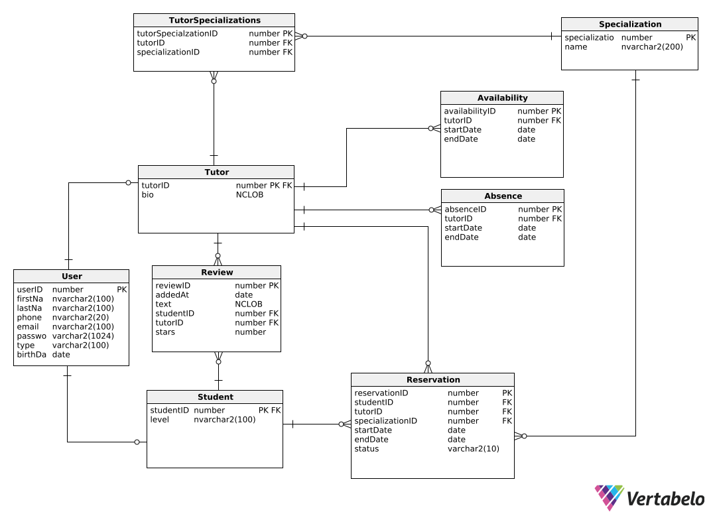

# Schemat bazy 

# Schemat 

Na początku stworzyliśmy schemat naszej bazy.
Który potem odwzorowaliśmy w hibernate.

Tabela recenzji została zostawiona na schemacie,
lecz jest ona niewykorzystana w naszym projekcie.




## User

Abstrakcyjna klasa reprezentująca użytkownika w systemie.

### Pola
- **userId**: `Long` - Unikalny identyfikator użytkownika.
- **firstName**: `String` - Imię użytkownika.
- **lastName**: `String` - Nazwisko użytkownika.
- **phone**: `String` - Numer telefonu użytkownika.
- **email**: `String` - Adres e-mail użytkownika. Musi być unikalny.
- **password**: `String` - Hasło użytkownika w postaci zahaszowanej.
- **type**: `UserType` - Typ użytkownika (STUDENT lub TUTOR).
- **birthDate**: `LocalDate` - Data urodzenia użytkownika.

### Konstruktor
- Domyślny konstruktor.
- Konstruktor z parametrami do inicjalizacji wszystkich pól poza `userId`.

### Klasy dziedziczące
- **Student** - Reprezentuje studenta w systemie.
- **Tutor** - Reprezentuje tutora w systemie.

```java
@Entity
@Table(name = "\"User\"", uniqueConstraints = {
        @UniqueConstraint(columnNames = "EMAIL")
})
@Inheritance(strategy = InheritanceType.JOINED)
public abstract class User {

    @Id
    @GeneratedValue(strategy = GenerationType.IDENTITY)
    @Column(name = "USERID", nullable = false)
    private Long userId;

    @NotBlank(message = "First name is required")
    @Column(name = "FIRSTNAME", nullable = false, length = 100)
    private String firstName;

    @NotBlank(message = "Last name is required")
    @Column(name = "LASTNAME", nullable = false, length = 100)
    private String lastName;

    @NotBlank(message = "Phone number is required")
    @PhoneNumber
    @Column(name = "PHONE", nullable = false, length = 20)
    private String phone;

    @Email(message = "Email must be valid")
    @Column(name = "EMAIL", nullable = false, length = 100)
    private String email;


    @NotBlank(message = "Password is required")
    @Column(name = "PASSWORD", nullable = false, length = 1024)
    private String password;

    @Enumerated(EnumType.STRING)
    @Column(name = "TYPE", nullable = false, length = 100)
    private UserType type;

    @NotNull(message = "Birthdate is required")
    @Past(message = "Birthdate must be in the past")
    @Column(name = "BIRTHDATE", nullable = false)
    private LocalDate birthDate;


    public User(String firstName, String lastName, String phone, String email, String password, UserType type, LocalDate birthDate) {
        this.firstName = firstName;
        this.lastName = lastName;
        this.phone = phone;
        this.email = email;
        this.password = password;
        this.type = type;
        this.birthDate = birthDate;
    }

    public User() {
    }
    
    // getters and setters omitted
}
```

## Tutor


Reprezentuje tutora w systemie.

### Pola
- zawiera wszystkie pola z klasy `User`
- **bio**: `String` - Krótki opis (biografia) tutora. Maksymalna długość to 4000 znaków.
- **specializations**: `Set<Specialization>` - Zestaw specjalizacji przypisanych do tutora.
- **absences**: `Set<Absence>` - Zestaw nieobecności tutora.
- **availabilities**: `Set<Availability>` - Zestaw dostępności tutora.
- **reservations**: `Set<Reservation>` - Zestaw rezerwacji powiązanych z tutorem.

### Połączenia
- Tutor może mieć wiele specjalizacji (`@ManyToMany`).
- Tutor może mieć wiele nieobecności (`@OneToMany`).
- Tutor może mieć wiele dostępności (`@OneToMany`).
- Tutor może mieć wiele rezerwacji (`@OneToMany`).

```java
@Entity
@Table(name = "TUTOR")
@PrimaryKeyJoinColumn(name = "TUTORID")
public class Tutor extends User {

    @ManyToMany
    @JoinTable(
            name = "TUTORSPECIALIZATIONS",
            joinColumns = @JoinColumn(name = "TUTORID"),
            inverseJoinColumns = @JoinColumn(name = "SPECIALIZATIONID")
    )
    private final Set<Specialization> specializations = new HashSet<>();
    @Column(name = "BIO", length = 4000, nullable = false)
    @Nationalized
    private String bio;
    @OneToMany(mappedBy = "tutor", cascade = CascadeType.ALL, orphanRemoval = true)
    private Set<Absence> absences = new HashSet<>();

    @OneToMany(mappedBy = "tutor", cascade = CascadeType.ALL, orphanRemoval = true)
    private Set<Availability> availabilities = new HashSet<>();

    @OneToMany(mappedBy = "tutor", cascade = CascadeType.ALL, orphanRemoval = true)
    private Set<Reservation> reservations = new HashSet<>();

    public Tutor() {
    }

    public Tutor(String firstName,
                 String lastName,
                 String phone,
                 String email,
                 String password,
                 String bio,
                 LocalDate birthDate) {
        super(firstName, lastName, phone, email, password, UserType.TUTOR, birthDate);
        this.bio = bio;
    }
    // getters and setters omitted
}
```

## Specialization


Reprezentuje specjalizację tutora.

### Pola
- **specializationId**: `Long` - Unikalny identyfikator specjalizacji. Generowany automatycznie.
- **name**: `String` - Nazwa specjalizacji. Musi być unikalna i nie może być pusta.
- **tutors**: `Set<Tutor>` - Zestaw tutorów powiązanych z tą specjalizacją.

### Połączenia
- Wiele specjalizacji może być powiązanych z wieloma tutorami (`@ManyToMany`).

### Konstruktor
- Domyślny konstruktor.
- Konstruktor z parametrem `name`.

```java
@Entity
@Table(name = "SPECIALIZATION",
        uniqueConstraints = @UniqueConstraint(columnNames = "NAME")
)
public class Specialization {

    @ManyToMany(mappedBy = "specializations")
    private final Set<Tutor> tutors = new HashSet<>();
    @Id
    @GeneratedValue(strategy = GenerationType.IDENTITY)
    @Column(name = "SPECIALIZATIONID", nullable = false)
    private Long specializationId;
    @NotBlank(message = "Specialization name is required")
    @Column(name = "NAME", nullable = false, length = 200)
    private String name;

    public Specialization() {
    }

    public Specialization(String name) {
        this.name = name;
    }
    
    // getters and setters omitted
}
```

## Student

Reprezentuje studenta w systemie.

### Pola
- zawiera wszystkie pola z klasy `User`
- **level**: `StudentLevel` - Poziom nauki studenta (PRIMARY_SCHOOL, MIDDLE_SCHOOL, HIGH_SCHOOL, COLLEGE, UNIVERSITY).
- **reservations**: `Set<Reservation>` - Zestaw rezerwacji powiązanych ze studentem.

### Połączenia
- Student może mieć wiele rezerwacji (`@OneToMany`).


```java
@Entity
@Table(name = "STUDENT")
@PrimaryKeyJoinColumn(name = "STUDENTID", referencedColumnName = "USERID")
public class Student extends User {
    @Enumerated(EnumType.STRING)
    @Column(name = "\"level\"", nullable = false, length = 100)
    private StudentLevel level;

    @OneToMany(mappedBy = "student", cascade = CascadeType.ALL, orphanRemoval = true)
    private Set<Reservation> reservations = new HashSet<>();

    public Student() {
    }

    public Student(String firstName,
                   String lastName,
                   String phone,
                   String email,
                   String password,
                   StudentLevel level,
                   LocalDate birthDate) {
        super(firstName, lastName, phone, email, password, UserType.STUDENT, birthDate);
        this.level = level;
    }

    // getters and setters omitted
}
```

## Availability

Reprezentuje dostępność tutora.

### Pola
- **availabilityId**: `Long` - Unikalny identyfikator dostępności. Generowany automatycznie.
- **tutor**: `Tutor` - Tutor powiązany z dostępnością.
- **startDateTime**: `LocalDateTime` - Data i czas rozpoczęcia dostępności.
- **endDateTime**: `LocalDateTime` - Data i czas zakończenia dostępności.

### Indeksy
- `Availability_idx_tutorID`: Indeks na kolumnie `TUTORID`.
- `Availability_idx_startDate`: Indeks na kolumnie `STARTDATE`.
- `Availability_idx_endDate`: Indeks na kolumnie `ENDDATE`.

### Połączenia
- Wiele dostępności może być powiązanych z jednym tutorem (`@ManyToOne`).


```java
@Entity
@ValidAvailabilityRange
@Table(name = "AVAILABILITY",
        indexes = {
                @Index(name = "Availability_idx_tutorID", columnList = "TUTORID"),
                @Index(name = "Availability_idx_startDate", columnList = "STARTDATE"),
                @Index(name = "Availability_idx_endDate", columnList = "ENDDATE")
        }
)
public class Availability {
    @Id
    @GeneratedValue(strategy = GenerationType.IDENTITY)
    @Column(name = "AVAILABILITYID", nullable = false)
    private Long availabilityId;

    @ManyToOne
    @JoinColumn(name = "TUTORID", nullable = false)
    private Tutor tutor;

    @NotNull(message = "Start date is required")
    @Column(name = "STARTDATE", nullable = false)
    private LocalDateTime startDateTime;


    @NotNull(message = "End date is required")
    @Column(name = "ENDDATE", nullable = false)
    private LocalDateTime endDateTime;


    public Availability() {
    }

    public Availability(Tutor tutor, LocalDateTime start, LocalDateTime end) {
        this.tutor = tutor;
        this.startDateTime = start;
        this.endDateTime = end;
    }
    
    // getters and setters omitted
}
```

## Absence

Reprezentuje nieobecność tutora.

### Pola
- **absenceId**: `Long` - Unikalny identyfikator nieobecności. Generowany automatycznie.
- **tutor**: `Tutor` - Tutor powiązany z nieobecnością.
- **startDate**: `LocalDateTime` - Data i czas rozpoczęcia nieobecności.
- **endDate**: `LocalDateTime` - Data i czas zakończenia nieobecności.

### Indeksy
- `Absence_idx_tutorID`: Indeks na kolumnie `TUTORID`.
- `Absence_idx_startDate`: Indeks na kolumnie `STARTDATE`.
- `Absence_idx_endDate`: Indeks na kolumnie `ENDDATE`.

### Połączenia
- Wiele nieobecności może być powiązanych z jednym tutorem (`@ManyToOne`).


```java
@Entity
@ValidAbsenceRange
@Table(name = "Absence",
        indexes = {
                @Index(name = "Absence_idx_tutorID", columnList = "TUTORID"),
                @Index(name = "Absence_idx_startDate", columnList = "STARTDATE"),
                @Index(name = "Absence_idx_endDate", columnList = "ENDDATE")
        }
)
public class Absence {
    @Id
    @GeneratedValue(strategy = GenerationType.IDENTITY)
    @Column(name = "ABSENCEID", nullable = false)
    private Long absenceId;

    @ManyToOne
    @JoinColumn(name = "TUTORID", nullable = false)
    private Tutor tutor;

    @Column(name = "STARTDATE", nullable = false)
    private LocalDateTime startDate;

    @Column(name = "ENDDATE", nullable = false)
    private LocalDateTime endDate;

    public Absence() {
    }

    public Absence(Tutor tutor, LocalDateTime startDate, LocalDateTime endDate) {
        this.tutor = tutor;
        this.startDate = startDate;
        this.endDate = endDate;
    }

    // getters and setters omitted
}
```

## Reservation

Reprezentuje rezerwację sesji z tutorem.

### Pola
- **reservationId**: `Long` - Unikalny identyfikator rezerwacji. Generowany automatycznie.
- **student**: `Student` - Student dokonujący rezerwacji.
- **tutor**: `Tutor` - Tutor powiązany z rezerwacją.
- **specialization**: `Specialization` - Specjalizacja powiązana z rezerwacją.
- **startDateTime**: `LocalDateTime` - Data i czas rozpoczęcia rezerwacji.
- **endDateTime**: `LocalDateTime` - Data i czas zakończenia rezerwacji.
- **status**: `ReservationStatus` - Status rezerwacji (ACCEPTED, CANCELLED, NEW).

### Indeksy
- `Reservation_idx_studentID`: Indeks na kolumnie `STUDENTID`.
- `Reservation_idx_tutorID`: Indeks na kolumnie `TUTORID`.
- `Reservation_idx_specializationID`: Indeks na kolumnie `SPECIALIZATIONID`.
- `Reservation_idx_startDate`: Indeks na kolumnie `STARTDATE`.
- `Reservation_idx_endDate`: Indeks na kolumnie `ENDDATE`.
- `Reservation_idx_status`: Indeks na kolumnie `STATUS`.

### Połączenia
- Wiele rezerwacji może być powiązanych z jednym studentem (`@ManyToOne`).
- Wiele rezerwacji może być powiązanych z jednym tutorem (`@ManyToOne`).
- Wiele rezerwacji może być powiązanych z jedną specjalizacją (`@ManyToOne`).

```java
@Entity
@Table(name = "RESERVATION",
        indexes = {
                @Index(name = "Reservation_idx_studentID", columnList = "STUDENTID"),
                @Index(name = "Reservation_idx_tutorID", columnList = "TUTORID"),
                @Index(name = "Reservation_idx_specializationID", columnList = "SPECIALIZATIONID"),
                @Index(name = "Reservation_idx_startDate", columnList = "STARTDATE"),
                @Index(name = "Reservation_idx_endDate", columnList = "ENDDATE"),
                @Index(name = "Reservation_idx_status", columnList = "STATUS")
        }
)
public class Reservation {

    @Id
    @GeneratedValue(strategy = GenerationType.IDENTITY)
    @Column(name = "RESERVATIONID", nullable = false)
    private Long reservationId;

    @ManyToOne
    @JoinColumn(name = "STUDENTID", nullable = false)
    private Student student;

    @ManyToOne
    @JoinColumn(name = "TUTORID", nullable = false)
    private Tutor tutor;

    @ManyToOne
    @JoinColumn(name = "SPECIALIZATIONID", nullable = false)
    private Specialization specialization;

    @NotNull(message = "Start time is required")
    @Column(name = "STARTDATE", nullable = false)
    private LocalDateTime startDateTime;

    @NotNull(message = "End time is required")
    @Column(name = "ENDDATE", nullable = false)
    private LocalDateTime endDateTime;

    @Enumerated(EnumType.STRING)
    @Column(name = "STATUS", length = 10, nullable = false)
    private ReservationStatus status;
    public Reservation() {}

    public Reservation(Student student, Tutor tutor, Specialization specialization, LocalDateTime start, LocalDateTime end) {
        this.student = student;
        this.tutor = tutor;
        this.specialization = specialization;
        this.startDateTime = start;
        this.endDateTime = end;
        this.status = ReservationStatus.NEW;
    }
    // getters and setters omitted
}
```
